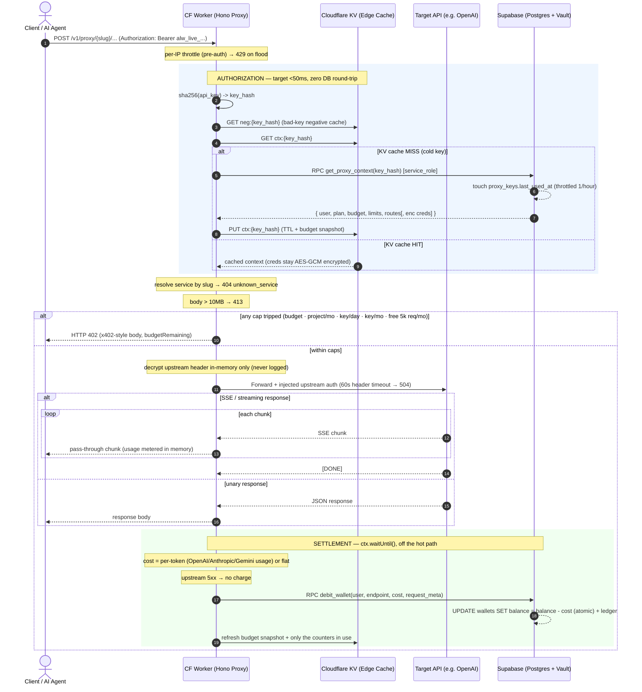

# Allowance — Request Lifecycle

```mermaid
sequenceDiagram
    autonumber
    actor Agent as Client / AI Agent
    participant CF as CF Worker (Hono Proxy)
    participant KV as Cloudflare KV (Edge Cache)
    participant API as Target API (e.g. OpenAI)
    participant SB as Supabase (Postgres + Vault)

    Agent->>CF: POST /v1/proxy/{slug}/...  (Authorization: Bearer alw_live_...)
    Note over CF: per-IP throttle (pre-auth) → 429 on flood

    rect rgb(238, 246, 255)
    Note over CF,KV: AUTHORIZATION — target <50ms, zero DB round-trip
    CF->>CF: sha256(api_key) -> key_hash
    CF->>KV: GET neg:{key_hash} (bad-key negative cache)
    CF->>KV: GET ctx:{key_hash}
    alt KV cache MISS (cold key)
        CF->>SB: RPC get_proxy_context(key_hash)  [service_role]
        SB-->>SB: touch proxy_keys.last_used_at (throttled 1/hour)
        SB-->>CF: { user, plan, budget, limits, routes[, enc creds] }
        CF->>KV: PUT ctx:{key_hash}  (TTL + budget snapshot)
    else KV cache HIT
        KV-->>CF: cached context (creds stay AES-GCM encrypted)
    end
    end

    Note over CF: resolve service by slug → 404 unknown_service
    Note over CF: body > 10MB → 413

    alt any cap tripped (budget · project/mo · key/day · key/mo · free 5k req/mo)
        CF-->>Agent: HTTP 402 (x402-style body, budgetRemaining)
    else within caps
        Note over CF: decrypt upstream header in-memory only (never logged)
        CF->>API: Forward + injected upstream auth (60s header timeout → 504)

        alt SSE / streaming response
            loop each chunk
                API-->>CF: SSE chunk
                CF-->>Agent: pass-through chunk (usage metered in memory)
            end
            API-->>CF: [DONE]
        else unary response
            API-->>CF: JSON response
            CF-->>Agent: response body
        end

        rect rgb(240, 255, 240)
        Note over CF,SB: SETTLEMENT — ctx.waitUntil(), off the hot path
        Note over CF: cost = per-token (OpenAI/Anthropic/Gemini usage) or flat
        Note over CF: upstream 5xx → no charge
        CF->>SB: RPC debit_wallet(user, endpoint, cost, request_meta)
        SB-->>SB: UPDATE wallets SET balance = balance - cost (atomic) + ledger
        CF->>KV: refresh budget snapshot + only the counters in use
        end
    end
```

Off the request path, a cron (`*/15min`) emails users whose remaining budget
dropped below their alert threshold (Resend; latched to once per 24h).
