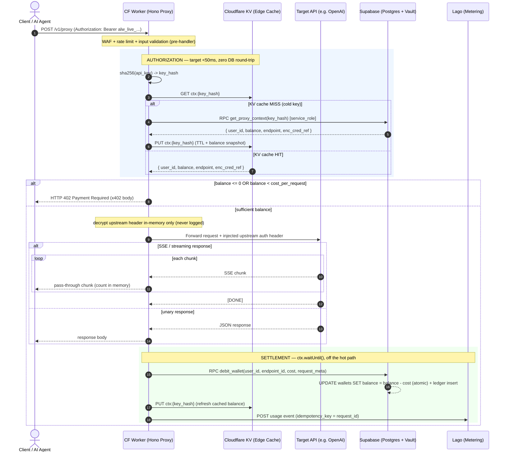

# Allowance — Request Lifecycle

```mermaid
sequenceDiagram
    autonumber
    actor Agent as Client / AI Agent
    participant CF as CF Worker (Hono Proxy)
    participant KV as Cloudflare KV (Edge Cache)
    participant API as Target API (e.g. OpenAI)
    participant SB as Supabase (Postgres + Vault)
    participant Lago as Lago (Metering)

    Agent->>CF: POST /v1/proxy  (Authorization: Bearer alw_live_...)
    Note over CF: WAF + rate limit + input validation (pre-handler)

    rect rgb(238, 246, 255)
    Note over CF,KV: AUTHORIZATION — target <50ms, zero DB round-trip
    CF->>CF: sha256(api_key) -> key_hash
    CF->>KV: GET ctx:{key_hash}
    alt KV cache MISS (cold key)
        CF->>SB: RPC get_proxy_context(key_hash)  [service_role]
        SB-->>CF: { user_id, balance, endpoint, enc_cred_ref }
        CF->>KV: PUT ctx:{key_hash}  (TTL + balance snapshot)
    else KV cache HIT
        KV-->>CF: { user_id, balance, endpoint, enc_cred_ref }
    end
    end

    alt balance <= 0  OR  balance < cost_per_request
        CF-->>Agent: HTTP 402 Payment Required (x402 body)
    else sufficient balance
        Note over CF: decrypt upstream header in-memory only (never logged)
        CF->>API: Forward request + injected upstream auth header

        alt SSE / streaming response
            loop each chunk
                API-->>CF: SSE chunk
                CF-->>Agent: pass-through chunk (count in memory)
            end
            API-->>CF: [DONE]
        else unary response
            API-->>CF: JSON response
            CF-->>Agent: response body
        end

        rect rgb(240, 255, 240)
        Note over CF,Lago: SETTLEMENT — ctx.waitUntil(), off the hot path
        CF->>SB: RPC debit_wallet(user_id, endpoint_id, cost, request_meta)
        SB-->>SB: UPDATE wallets SET balance = balance - cost (atomic) + ledger insert
        CF->>KV: PUT ctx:{key_hash}  (refresh cached balance)
        CF->>Lago: POST usage event (idempotency_key = request_id)
        end
    end
```
